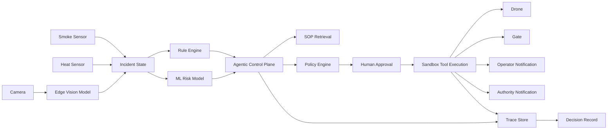

# AgenticOps Studio

AgenticOps Studio is an interactive full-stack explainer for Physical AI and enterprise agentic AI. It demonstrates how rule-based automation, ML-based prediction, and governed agentic AI behave differently in a fire-response workflow.

In enterprise agentic AI, the model reasons, tools act, policy constrains, humans approve, and the platform records every decision.

Most agent demos stop at tool calling. AgenticOps Studio shows the missing enterprise layers: edge perception, risk models, tools, policy, human approval, observability, and auditable execution.

The LLM is not the control system. It is one reasoning component inside a governed execution stack.

## Why This Project Exists

Physical AI connects AI systems to real-world signals and actuators. That raises the bar for safety, evidence, approval, policy, traceability, and auditability. AgenticOps Studio makes those layers visible in a serious, deployable reference implementation.

## What It Demonstrates

- Rule-based automation detects threshold events.
- ML predicts fire probability from fused evidence.
- Agentic AI coordinates SOP, tools, policy, and human approval.
- Enterprise agentic AI governs execution and records decisions.
- Roboflow hosted inference runs through a server route when configured.
- OpenAI Responses API runs through a server route when configured.
- TensorFlow.js trains a real browser-side risk model.

## Live Demo

Vercel URL: https://agenticops-studio.vercel.app

## Architecture Diagram



## Rule-Based vs ML vs Agentic

Rule-based automation is fast and deterministic, but only sees predefined inputs. ML-based prediction learns patterns and estimates probability, but does not coordinate response. Governed agentic AI fuses evidence, SOPs, policies, tools, approvals, and traces to propose safe action.

## Physical AI

Physical AI is AI connected to real-world signals and actuators: smoke sensors, heat sensors, cameras, occupancy signals, drones, smart gates, and notification systems.

## Edge AI

Edge AI runs perception and first-level intelligence near the device. It reduces latency and bandwidth, supports privacy and data residency, improves resilience during cloud outages, enables local first response, and can lower cost at fleet scale.

## Agentic AI Stack

Rule-based automation detects. ML predicts. Agentic AI coordinates. Enterprise agentic AI governs execution.

## Guardrails and Policy

The app includes schema guardrails, policy guardrails, evidence sufficiency checks, human approval gates, tool permission checks, and physical safety constraints. Physical action tools default to sandbox mode.

## Human-in-the-Loop Approval

Gate unlock, drone dispatch under uncertainty, and authority notification under high-risk conditions require explicit demo-operator approval before execution.

## Observability and Decision Records

Every run emits structured trace events and can write a decision record containing inputs, rule results, ML results, vision results, agent proposals, policy decisions, approvals, execution results, governance metadata, and trace history.

## Tech Stack

Next.js App Router, TypeScript, Tailwind CSS, shadcn-style components, Framer Motion, React Flow, Zod, OpenAI SDK, `@openai/agents` dependency, TensorFlow.js, Roboflow hosted inference API, Pino logging, Vitest, and Vercel.

## Run Locally

```bash
npm install
npm run dev
```

Open `http://localhost:3000`.

## Configure OpenAI

Create `.env.local`:

```bash
OPENAI_API_KEY=...
OPENAI_MODEL=gpt-5.5
```

If `gpt-5.5` is not available in your account, set `OPENAI_MODEL=gpt-5.4-mini` or any model your account supports.

The deployed app never exposes OpenAI keys to the browser. Without `OPENAI_API_KEY`, the agent route intentionally uses a deterministic governed fallback planner so the demo still works. With `OPENAI_API_KEY`, `/api/agent/run` and `/api/agent/report` call OpenAI from server routes and validate structured JSON output before the UI accepts it.

Limits and cost controls are inherited from your OpenAI account and selected model. The app keeps calls explicit: no background loop runs unless the user presses the agent/report buttons.

## Configure Roboflow

```bash
ROBOFLOW_API_KEY=...
ROBOFLOW_MODEL_ID=fire-and-smoke-detection-hiwia/2
ROBOFLOW_API_URL=https://serverless.roboflow.com
```

Without a key, the app returns sample predictions and shows setup guidance.

## Deploy to Vercel

1. Import the GitHub repo into Vercel.
2. Framework: Next.js.
3. Build command: `npm run build`.
4. Add OpenAI and Roboflow environment variables as needed.
5. Deploy.

## Enterprise Extension Path

The `enterprise/` folder documents the production path: MQTT ingestion, Kafka/Event Hubs, ONNX/YOLO edge inference, MLflow, OPA/Rego, OpenTelemetry/Grafana/Tempo/Loki, Postgres event store, vector DB SOP retrieval, Kubernetes, RBAC, immutable audit logs, and governed authority integrations.

## Roadmap

- Add persisted Postgres audit store.
- Add OpenTelemetry export.
- Add camera stream ingestion adapter.
- Add model-evaluation dashboard.
- Add signed policy bundles.

## Screenshots / GIFs

Add screenshots for the Studio, Edge Vision Lab, ML Training Lab, Architecture page, and Decision Record viewer after deployment.
