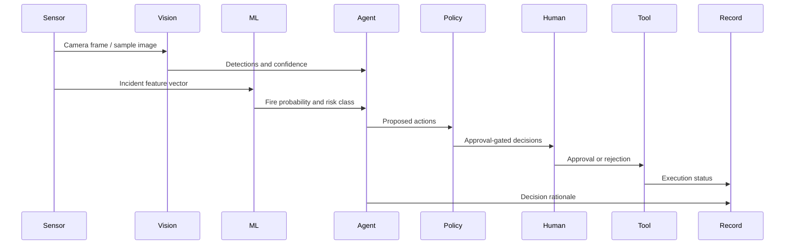

# Architecture

## Runtime Boundaries

Browser: scenario state, TF.js training, trace viewer, approvals, decision-record local/session storage.

Server routes: OpenAI Agents SDK planner, Roboflow inference, OpenAI report generation, structured logs, safe error handling.

External services: OpenAI Responses API and Roboflow hosted inference when credentials are configured.

## Actual Agent Runtime

`/api/agent/run` is the governed planning boundary. It receives incident state, rule output, ML output, vision output, tool registry, policy summary, and runtime controls. The route then:

1. Validates input with Zod.
2. Creates a `Physical AI Response Planner` using `@openai/agents`.
3. Runs the agent with the configured `OPENAI_MODEL`.
4. Validates final output against `AgenticResult`.
5. Runs local TypeScript policy checks over proposed actions.
6. Returns the planner result, runtime label, provider label, and fallback message when applicable.

The public demo never lets the model execute physical actions. The model proposes. Policy constrains. Human approval gates. Sandbox tools simulate execution. The decision record captures the run.

## UI Evidence Map

- Scenario tab: physical signal and actuator state.
- Physical AI tab: layered explanation from devices to governed execution.
- Edge Vision tab: Roboflow or sample image inference updates camera confidence.
- ML tab: TensorFlow.js trains and predicts risk in the browser.
- Agentic tab: custom React Flow orchestration nodes plus Agent Run Console.
- Tools tab: tool contracts, execution mode, policy, and approval requirements.
- Approval tab: demo operator approval or rejection.
- Trace tab: structured event timeline.
- Record tab: auditable decision record.
