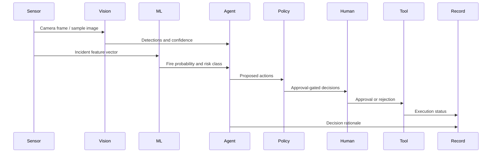

# Architecture

## Runtime Boundaries

Browser: scenario state, TF.js training, trace viewer, approvals, decision-record local/session storage.

Server routes: OpenAI, Roboflow, report generation, structured logs, safe error handling.

External services: OpenAI Responses API and Roboflow hosted inference when credentials are configured.
